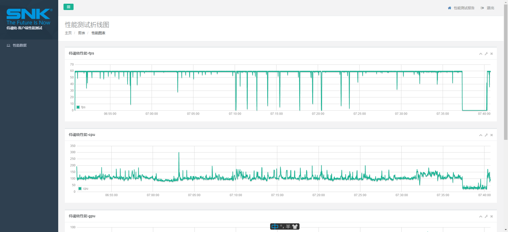

# ios-
主要是针对某个app进行性能测试，会生成图示。也可以启动服务让性能测试的数据展示在web页面内，动态显示结果。

Mac 有 xcode的instrument去进行性能测试，所以这个脚本仅仅针对于一些需求Wino用户的小伙伴进行iosApp的性能测试

首先需要配置 81 行 - 83 行
    
    # 这里配置你的包名
    perf.start("com.netflix.NGP.SamuraiShowdownNETFLIX", callback=callback)
    time.sleep(3000) # 这里配置时间 ，秒为单位
    perf.stop()

然后 你就可以运行来抓取数据了

    python main.py

它会自动生成 .png的性能测试图片。

你也可以启动flask服务

    python app.py   

然后在 
    
    ./hplus/perf_show.html 
中看到性能数据

像这样。

前提是你得先安装requirements 里的依赖！